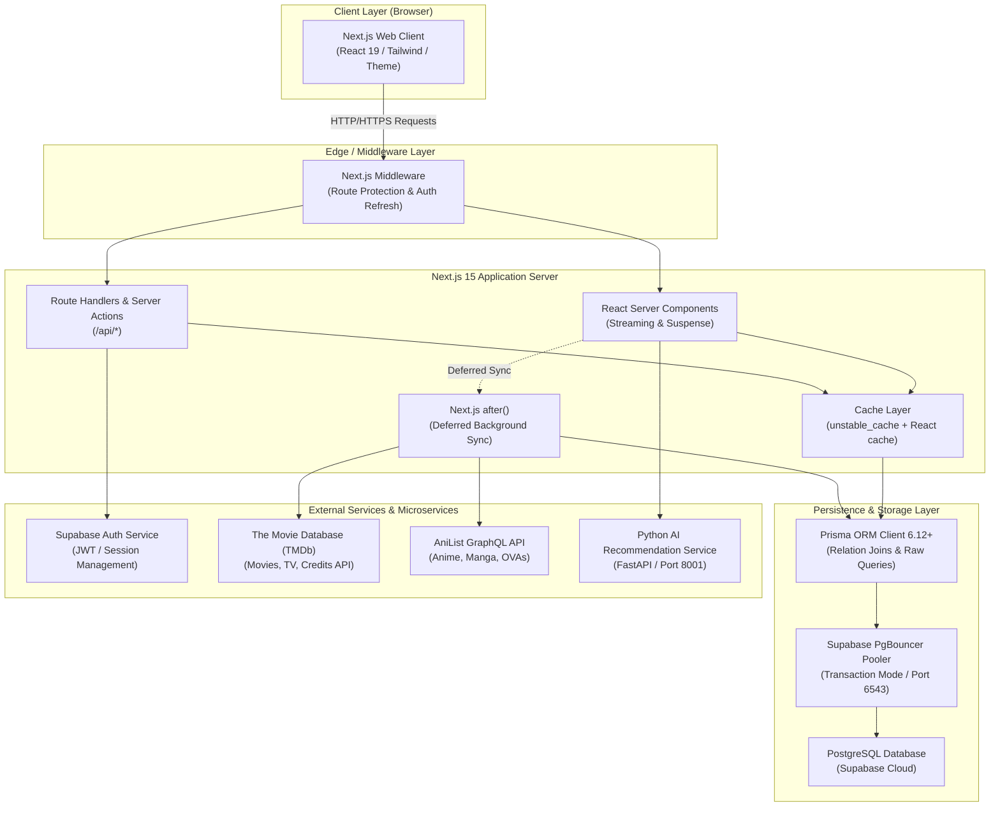
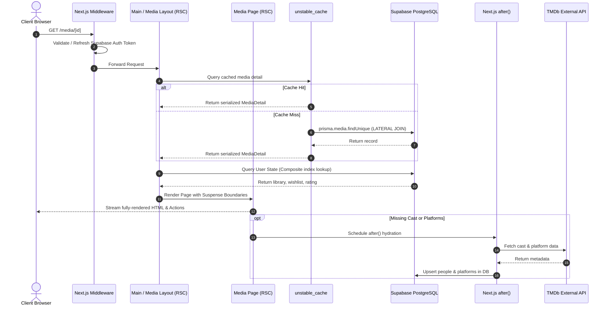
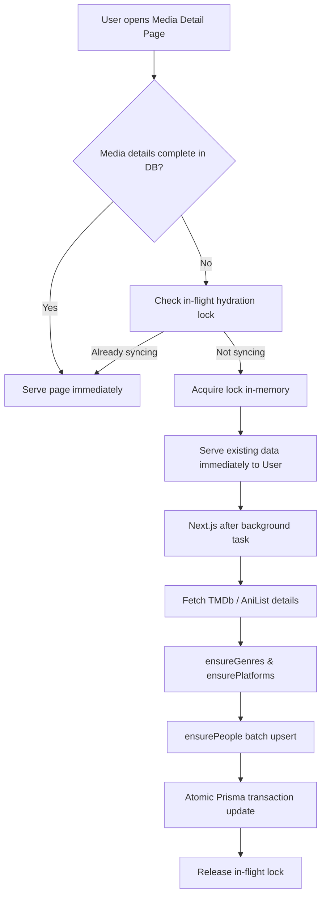
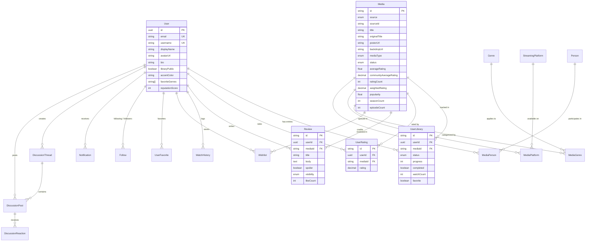

# MovieMinds — System Architecture & Design Document

**Document Version:** 1.0.0  
**Last Updated:** August 2026  
**System Classification:** Production Architecture  

---

## 1. System Overview & High-Level Architecture

**MovieMinds** is built as a modern, decoupled web application utilizing **Next.js 15 (App Router)** with **React 19 Server Components**, backed by a **Supabase PostgreSQL** database accessed via **Prisma ORM** through **PgBouncer** connection pooling, and integrated with an auxiliary **Python ML Recommendation Microservice**.

### High-Level Architecture Diagram



---

## 2. Technology Stack & Ecosystem

### 2.1 Core Frameworks & Runtime
- **Frontend / Application Framework**: [Next.js 15.4.2](https://nextjs.org/) (App Router, Server Actions, React Server Components).
- **UI Library**: [React 19.1.0](https://react.dev/) (Concurrent Features, Streaming Suspense, Server Functions).
- **Language**: [TypeScript 5.8+](https://www.typescriptlang.org/) with strict type-checking.
- **Styling & Design System**: [Tailwind CSS 3.4](https://tailwindcss.com/), `tailwind-merge`, `class-variance-authority` (`cva`), `lucide-react` icons.
- **Theme Management**: `next-themes` (Seamless Dark / Light mode switching).
- **Visualization / Charts**: `recharts` (Interactive stats, distribution curves, donut charts).

### 2.2 Backend & Data Persistence
- **Database**: [PostgreSQL](https://www.postgresql.org/) (Hosted on Supabase Cloud).
- **Connection Pooler**: [PgBouncer](https://www.pgbouncer.org/) (Transaction mode on port `6543`).
- **ORM / Query Engine**: [Prisma ORM 6.12.0](https://www.prisma.io/) (`@prisma/client` with `relationJoins` preview feature).
- **Authentication**: [Supabase Auth SSR](https://supabase.com/docs/guides/auth/server-side/nextjs) (`@supabase/ssr` with HttpOnly cookie handling).
- **Validation**: [Zod](https://zod.dev/) & [React Hook Form](https://react-hook-form.com/).
- **Structured Logging**: [Pino](https://getpino.io/) + `pino-pretty`.

### 2.3 External APIs & AI Microservice
- **TMDb API**: Movie and TV metadata, high-resolution artwork, credits, streaming providers.
- **AniList API**: Anime series, OVA, and anime movie metadata via GraphQL.
- **Python AI Microservice**: FastAPI server running on `http://127.0.0.1:8001` providing user recommendation scoring, semantic item similarity, and taste compatibility matching.

---

## 3. Core Application Flows & Architecture

### 3.1 Request & Rendering Lifecycle
MovieMinds maximizes user-perceived performance by separating **critical UI rendering** from **background metadata synchronization**.



### 3.2 Authentication & Session Flow
Authentication relies on Supabase Auth SSR cookies with row-level identity sharing.

1. **Client Authentication**: User submits credentials via `/login` or `/signup`.
2. **Session Cookie**: Supabase sets an encrypted, HttpOnly session cookie (`sb-<project-ref>-auth-token`).
3. **Middleware Interception** (`middleware.ts`):
   - Reads the cookie on every request.
   - Refreshes expired sessions automatically via `supabase.auth.getUser()`.
   - Protects private routes (`/library`, `/profile`, `/notifications`, `/feed`).
4. **Server Profile Provisioning** (`lib/profile.ts`):
   - React `cache()` wraps profile retrieval so `prisma.user.findUnique` executes at most once per request cycle.
   - Graceful fallback creates an in-memory profile representation if transient database pooler delays occur.

---

### 3.3 Media Ingestion & Deferred Sync Flow
To prevent external API rate-limiting or network latency from slowing down user navigation:



---

### 3.4 AI Recommendation & ML Pipeline
The recommendation architecture utilizes a multi-tiered approach:

1. **Candidate Retrieval**: Lean SQL query selects top popular and highly-rated media rows (`narrowCardSelect`).
2. **User Profile Compilation**: Formulates the user's interaction payload (rated media, status, favorite genres).
3. **Microservice Dispatch**: Sends a vectorized JSON request to the FastAPI AI service (`/recommend/user` or `/recommend/similar`) with a 500ms timeout budget.
4. **Heuristic Fallback**: If the microservice is offline or times out, the application instantly computes a deterministic fallback based on top genres and Bayesian ratings.
5. **Caching**: Results are stored in `unstable_cache` with user/media-scoped tags for 30–60 minutes.

---

## 4. Folder & File Structure

```
MovieMinds/
├── app/                                  # Next.js 15 App Router Directory
│   ├── (auth)/                           # Authentication Route Group
│   │   ├── login/                        # Sign In page
│   │   └── signup/                       # Registration page
│   ├── (main)/                           # Authenticated & Main Navigation Route Group
│   │   ├── layout.tsx                    # AppShell wrapper & Profile hydration
│   │   ├── page.tsx                      # Home Dashboard (Discovery, Trending, Watching)
│   │   ├── community/                    # Discussion Forums & Thread views
│   │   ├── explore/                      # Multi-source Catalog Discovery & Filter Grid
│   │   ├── feed/                         # Social Activity Feed
│   │   ├── library/                      # Personal Collection & Watchlist Management
│   │   ├── media/                        # Media Detail routes
│   │   │   └── [id]/                     # Dynamic Media Detail Page & Layout
│   │   ├── notifications/                # In-App Notifications Center
│   │   ├── people/                       # Creator & Cast Directory
│   │   ├── profile/                      # User Profile view & settings
│   │   ├── stats/                        # Personal Viewing Analytics & Charts
│   │   └── user/[id]/                    # Public Profile & Taste Match viewer
│   ├── api/                              # REST API Route Handlers
│   │   ├── catalog/                      # Catalog sync endpoints
│   │   ├── discussions/                  # Community forum CRUD & reactions
│   │   ├── library/                      # Library entry mutations
│   │   ├── media/                        # Media querying & detail endpoints
│   │   ├── notifications/                # Mark as read / notification streams
│   │   ├── profile/                      # Profile updates & customization
│   │   ├── ratings/                      # Rating submission & distribution
│   │   ├── reviews/                      # Review creation & voting
│   │   ├── search/                       # Unified catalog search handler
│   │   ├── social/                       # Follow / unfollow mutations
│   │   └── wishlist/                     # Wishlist ordering & prioritization
│   ├── globals.css                       # Global Tailwind CSS styles & CSS tokens
│   └── layout.tsx                        # Root HTML Layout & Theme Provider
│
├── components/                           # Reusable UI & Business Components
│   ├── auth/                             # Login/Signup forms and card containers
│   ├── community/                        # Discussion thread cards, editor, post rows
│   ├── explore/                          # Category pills, hero banners, pagination
│   ├── feed/                             # Social activity cards & timeline widgets
│   ├── filters/                          # Filter sidebar, active filter chips, sort dropdown
│   ├── home/                             # Hero section, continue watching row, trending rows
│   ├── layout/                           # AppShell, Navigation Bar, Sidebar, Footer
│   ├── library/                          # Library dashboard, status tabs, action buttons
│   ├── media/                            # MediaCard, MediaGrid, CastCarousel, WhereToWatch
│   ├── navigation/                       # Search bar, user menu, mobile navigation
│   ├── profile/                          # Banner editor, accent color picker, stats showcase
│   ├── ratings/                          # Star rating input, distribution histograms
│   ├── reviews/                          # Review writer, spoiler blur cards, like button
│   ├── social/                           # Follow button, follower lists, taste match bar
│   ├── stats/                            # Recharts analytics widgets, viewing breakdown
│   └── ui/                               # Atomic primitives (buttons, modals, badges, inputs)
│
├── lib/                                  # Core Business Logic & Infrastructure Modules
│   ├── activity/                         # Activity logging & feed generation
│   ├── ai/                               # Python ML client & recommendation fallback logic
│   ├── anilist/                          # AniList GraphQL client & normalizers
│   ├── auth/                             # Server auth session helpers (`requireUser`)
│   ├── cache/                            # Cache tags & invalidation routines
│   ├── community/                        # Discussion thread queries & handlers
│   ├── library/                          # Library, stats, and user state queries
│   ├── media/                            # Media queries, serializers, filters, aggregates, sync
│   ├── notifications/                    # Notification dispatch & grouping utilities
│   ├── prisma.ts                         # Singleton Prisma client with slow-query logging
│   ├── profile.ts                        # Profile retrieval & creation with request caching
│   ├── ratings/                          # Rating calculations & Bayesian averages
│   ├── reviews/                          # Review management queries
│   ├── social/                           # Follow graph operations & social queries
│   ├── supabase/                         # Supabase browser & server SSR client factories
│   ├── tmdb/                             # TMDb REST API client & transformers
│   └── utils.ts                          # ClassName merging (`cn`) & string utilities
│
├── prisma/                               # Database Definition & Migrations
│   ├── schema.prisma                     # Complete PostgreSQL Data Model
│   └── migrations/                       # SQL migration history
│
├── types/                                # Global TypeScript Type Definitions
│   ├── library.ts                        # Library status & entry types
│   ├── media.ts                          # MediaDetail, MediaSummary, Normalized types
│   ├── profile.ts                        # User profile & setting types
│   ├── rating.ts                         # Rating & distribution histogram types
│   └── review.ts                         # Review & visibility types
│
├── next.config.ts                        # Next.js Server & allowedDevOrigins configuration
├── package.json                          # Project dependencies & build scripts
├── tailwind.config.ts                    # Tailwind CSS theming & design tokens
└── tsconfig.json                         # TypeScript compiler configuration
```

---

## 5. Database Entity Relationship Diagram



---

## 6. Performance, Caching & Resilience Strategy

### 6.1 Multi-Tier Caching Matrix

| Layer | Mechanism | Scope | Invalidation Strategy |
| :--- | :--- | :--- | :--- |
| **Request-Level Deduplication** | React `cache()` | Per HTTP Request | Automatically garbage collected at end of request. |
| **Catalog Exploration** | Next.js `unstable_cache` | Shared Public | 1 hour TTL (`revalidate: 3600`), tagged with `explore`, `catalog`. |
| **Media Details** | Next.js `unstable_cache` | Shared Public | 1 hour TTL, tagged with `media-${id}`. |
| **Similar Titles** | Next.js `unstable_cache` | Shared Public | 1 hour TTL, tagged with `similar-media`. |
| **Personal Recommendations** | Next.js `unstable_cache` | User-Scoped | 30 min TTL, tagged with `user-${userId}-recs`. |
| **User Rating Analytics** | Next.js `unstable_cache` | User-Scoped | 30 min TTL, tagged with `user-stats-${userId}`. |

### 6.2 Connection Pool Safety Principles
1. **Sequential Safe Execution**: Eliminates unconstrained parallel database connections on the PgBouncer pooler (`pool=20`).
2. **Direct Composite-Key Queries**: Parameterized `$queryRaw` queries target `(userId, mediaId)` B-tree unique indexes directly in O(1) time without nested row scanning.
3. **Narrow Projection**: List cards select only 10 needed fields instead of loading 30 database columns.
4. **COUNT(*) Elimination**: Fixed-limit discovery rows skip expensive table count aggregations.
5. **In-Flight Deduplication Lock**: Background TMDb syncs maintain an in-memory lock set so duplicate concurrent user visits do not spawn multiple background ingestion tasks.

---

## 7. Security Architecture

- **Data Isolation**: User library items, ratings, and wishlists are keyed by authenticated `UUID` linked to Supabase Auth.
- **Environment Separation**: Sensitive keys (`SUPABASE_SERVICE_ROLE_KEY`, `DATABASE_URL`, `DIRECT_URL`) are strictly kept server-side and never exposed to the client bundle.
- **Cross-Origin Dev Configuration**: Local development subnets (`10.210.172.208`, `192.168.1.7`, `localhost`) are explicitly whitelisted in `allowedDevOrigins` in `next.config.ts`.
- **Input Sanitization & Validation**: All user mutations (reviews, forum posts, profile changes) pass through Zod schemas before database persistence.
- **Spoiler Protection**: Content flagged as spoiler is obscured behind an interactive blur overlay to protect user experience.
