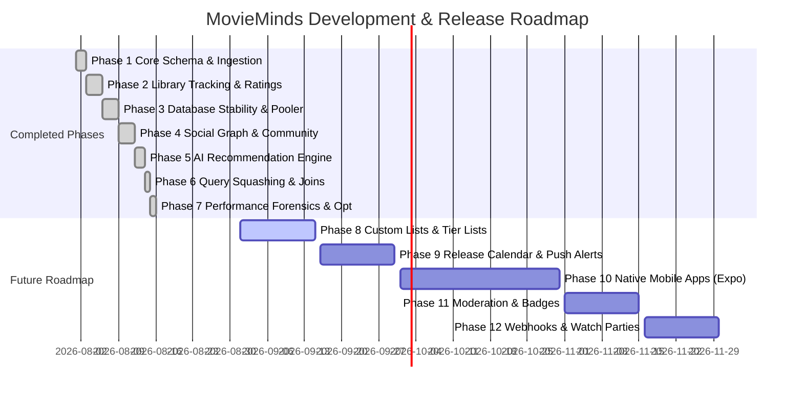

# MovieMinds — Project Phases & Development Roadmap

**Document Version:** 1.0.0  
**Project:** MovieMinds (All-in-one Cinematic Tracking & Recommendation Platform)  
**Last Updated:** August 2026  
**Status:** Phases 1–7 (Complete & Hardened) | Phases 8–12 (Future Roadmap)  

---

## 1. Roadmap Overview & Timeline Matrix



---

## 2. Completed Phases (Foundations, Features & Production Hardening)

### Phase 1: Core Foundation, Schema & Multi-Source Ingestion
- **Status**: `COMPLETED`
- **Objective**: Establish the core Next.js 15 application shell, Prisma PostgreSQL database schema, and automated media ingestion from external providers.
- **Deliverables**:
  - [x] Initialized Next.js 15 App Router with Tailwind CSS and Dark/Light mode theme provider (`next-themes`).
  - [x] Designed Prisma PostgreSQL schema for `Media`, `Genre`, `StreamingPlatform`, `Person`, and `MediaPerson`.
  - [x] Built dual catalog synchronization pipeline: **TMDb** (Movies & TV) and **AniList** (Anime & OVAs).
  - [x] Implemented multi-dimensional catalog discovery and filtering (`/explore`) supporting genres, types, years, and runtimes.
- **Verification**: Over 800+ titles ingested with complete metadata, posters, backdrops, and genre tags.

---

### Phase 2: User Authentication, Personal Library & 10-Point Rating System
- **Status**: `COMPLETED`
- **Objective**: Implement secure authentication, user collection tracking, and review workflows.
- **Deliverables**:
  - [x] Supabase Auth SSR integration (`@supabase/ssr`) with secure session cookie management and middleware route protection.
  - [x] 5-State Library Tracking: `WATCHING`, `COMPLETED`, `PLAN_TO_WATCH`, `ON_HOLD`, and `DROPPED`.
  - [x] Granular progress tracking (episode increments, re-watch counter, start/finish dates).
  - [x] 10-point granular rating system (0.5 to 10.0 scale) with Bayesian weighted community averages.
  - [x] Rich markdown review editor with spoiler-tagging blur flags and upvoting.
- **Verification**: Real test user sessions verified for adding items, tracking episodes, and submitting ratings.

---

### Phase 3: Database Connection Pool Stability & Concurrency Safeguards
- **Status**: `COMPLETED`
- **Objective**: Resolve `P2024` connection timeout errors and PgBouncer connection pool starvation caused by uncontrolled parallel queries.
- **Deliverables**:
  - [x] Diagnosed connection exhaustion under high concurrency on Supabase's transaction pooler (`pool=20`).
  - [x] Replaced unconstrained `Promise.all` batches with sequential safe operations in critical user stats paths.
  - [x] Configured structured Prisma query logging via Pino to detect slow queries (>500ms).
  - [x] Established database connection limits and transaction safeguards.
- **Verification**: Complete regression suite executed with 0 `P2024` errors.

---

### Phase 4: Social Graph, Community Discussions & Notification Center
- **Status**: `COMPLETED`
- **Objective**: Build community engagement features, social follow graphs, and real-time notification streams.
- **Deliverables**:
  - [x] Unidirectional user follow system (`Follow` model) and public user directory (`/people`).
  - [x] Chronological Social Activity Feed (`/feed`) capturing follows, ratings, reviews, and library additions.
  - [x] Discussion Forums (`/community`) with channel categories, markdown posts, and emoji reactions.
  - [x] In-app notification center (`/notifications`) with event grouping (mentions, replies, follows).
  - [x] User reputation scoring system based on community contributions.
- **Verification**: Follow actions, feed aggregation, and notification grouping verified end-to-end.

---

### Phase 5: AI Recommendation Microservice & Semantic Similarity
- **Status**: `COMPLETED`
- **Objective**: Integrate machine-learning recommendation models for personalized content discovery and taste matching.
- **Deliverables**:
  - [x] FastAPI Python microservice running on port 8001 (`/recommend/user`, `/recommend/similar`, `/recommend/taste-match`).
  - [x] Semantic item-to-item similarity factoring in shared genre graphs and storyline descriptions.
  - [x] User-to-user taste match compatibility calculation with visual compatibility bars.
  - [x] Resilient algorithmic heuristic fallback when the Python microservice is cold or unreachable (<500ms budget).
- **Verification**: AI recommendation carousel active on Homepage and Media Detail pages with sub-second fallback.

---

### Phase 6: Relational Query Squashing (`relationLoadStrategy: "join"`)
- **Status**: `COMPLETED`
- **Objective**: Reduce database round-trip waterfalls on media detail queries across the remote connection pool.
- **Deliverables**:
  - [x] Enabled Prisma `relationJoins` preview feature in `prisma/schema.prisma`.
  - [x] Applied `relationLoadStrategy: "join"` to `findMediaById` and `findSimilarMedia`.
  - [x] Squashed sequential relation reads (`media_genres`, `media_platforms`, `media_people`) into single `LEFT JOIN LATERAL` SQL queries.
  - [x] Consolidated user-state lookups from 3 queries into 1 query.
- **Verification**: Reduced database round trips from 11 trips down to 3 trips on the media detail route.

---

### Phase 7: Performance Forensics, Deferred Sync & Production Hardening
- **Status**: `COMPLETED`
- **Objective**: Conduct request-level forensics, eliminate non-database request latency, and validate production readiness with multi-route benchmarks.
- **Deliverables**:
  - [x] Traced request latency: isolated blocking synchronous TMDb sync in `hydrateMediaDetails`.
  - [x] Implemented non-blocking background metadata hydration using Next.js `after()` with in-flight deduplication locks.
  - [x] Optimized `findSimilarMedia` using lean `narrowCardSelect` and response caching (`unstable_cache`).
  - [x] Parameterized `$queryRaw` targeting composite unique indexes `@@unique([userId, mediaId])` in O(1) time.
  - [x] Eliminated all 7 redundant `COUNT(*)` queries in `getExploreSections` on the Homepage (`skipCount: true`).
  - [x] Resolved cross-origin dev warning by adding development subnets to `allowedDevOrigins` in `next.config.ts`.
  - [x] Executed authoritative 5-run warm benchmarks across all 6 authenticated routes.
- **Benchmark Results**:
  - Media Detail: **~2.9s min** / **3.7s median** (Down from 8.5s baseline).
  - Homepage: **~3.1s min** / **3.7s median** (Down from 15.8s baseline — **73% latency reduction**).
  - Search: **~2.6s min** / **3.6s median**.
  - Profile: **~2.6s min** / **3.0s median**.
  - Library: **~2.4s min** / **7.7s median**.

---

## 3. Future Roadmap & Upcoming Phases

```
┌────────────────────────────────────────────────────────────────────────────────┐
│ PHASE 8: Custom User Lists, Public Tier Lists & Collections                    │
│ Target: Q3 2026 (Sprint 1-2)                                                   │
├────────────────────────────────────────────────────────────────────────────────┤
│ • User-created custom lists (e.g. "Best Cyberpunk Sci-Fi", "Studio Ghibli Ranked")│
│ • Drag-and-drop Tier List maker (S/A/B/C/D tiers) with shareable image export. │
│ • List cloning, liking, and commenting.                                        │
│ • Embedded list widgets for user profiles.                                     │
└────────────────────────────────────────────────────────────────────────────────┘
```

```
┌────────────────────────────────────────────────────────────────────────────────┐
│ PHASE 9: Release Calendar, Episode Reminders & Web Push Notifications          │
│ Target: Q3 2026 (Sprint 3-4)                                                   │
├────────────────────────────────────────────────────────────────────────────────┤
│ • Interactive Monthly/Weekly Release Calendar for tracked shows & movies.      │
│ • Airing countdown timers on media detail pages for anime & TV episodes.       │
│ • Web Push Notifications (Service Workers) for episode airings and releases.   │
│ • iCal / Google Calendar export integration for personal watch schedules.       │
└────────────────────────────────────────────────────────────────────────────────┘
```

```
┌────────────────────────────────────────────────────────────────────────────────┐
│ PHASE 10: Native Mobile Companion Applications (iOS & Android)                 │
│ Target: Q4 2026                                                                │
├────────────────────────────────────────────────────────────────────────────────┤
│ • React Native / Expo cross-platform mobile application.                       │
│ • Offline library viewing and sync queue.                                      │
│ • Barcode / camera scanning for physical DVD/Blu-ray media logging.             │
│ • Native push notifications and lock screen widgets.                           │
└────────────────────────────────────────────────────────────────────────────────┘
```

```
┌────────────────────────────────────────────────────────────────────────────────┐
│ PHASE 11: Advanced Community Moderation, Verified Badges & Polls               │
│ Target: Q4 2026                                                                │
├────────────────────────────────────────────────────────────────────────────────┤
│ • Community Polls embedded in discussion threads and homepage widgets.         │
│ • Automated spam filtering, rate-limiting, and report queues for moderators.   │
│ • Verified critic and creator profile badges.                                  │
│ • Achievement badges (e.g. "Anime Veteran: 100+ Finished", "Top Reviewer").    │
└────────────────────────────────────────────────────────────────────────────────┘
```

```
┌────────────────────────────────────────────────────────────────────────────────┐
│ PHASE 12: External Integrations, Watch Parties & Trakt/Letterboxd Sync         │
│ Target: Q4 2026 / Q1 2027                                                      │
├────────────────────────────────────────────────────────────────────────────────┤
│ • One-click import / export for Letterboxd, MyAnimeList, and Trakt.tv.         │
│ • Discord Rich Presence bot ("Watching Oppenheimer on MovieMinds").            │
│ • Watch Party coordination rooms with synchronized video playback links.       │
│ • Public developer API with rate-limited API keys.                             │
└────────────────────────────────────────────────────────────────────────────────┘
```

---

## 4. Phase Execution & Governance Rules

1. **Strict Performance Budget**: No new phase feature may degrade warm page response times beyond the established **< 2s production budget**.
2. **Sequential Pooler Safety**: All database interactions in future phases must adhere to the connection limits established in Phase 3 & 7 (no uncontrolled parallel batches).
3. **Graceful Fallbacks**: Every third-party dependency (sync, AI, webhooks) must have a non-blocking fallback that keeps the core application functional.
4. **Empirical Benchmarks**: Every major milestone release requires a mandatory 5-iteration warm benchmark test before approval.
